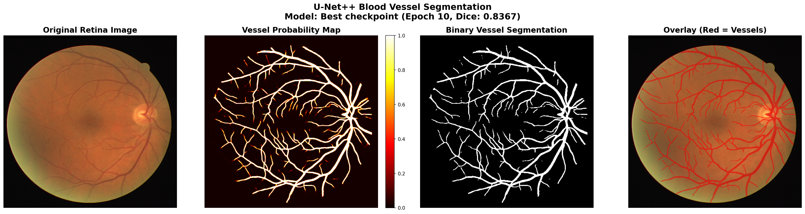
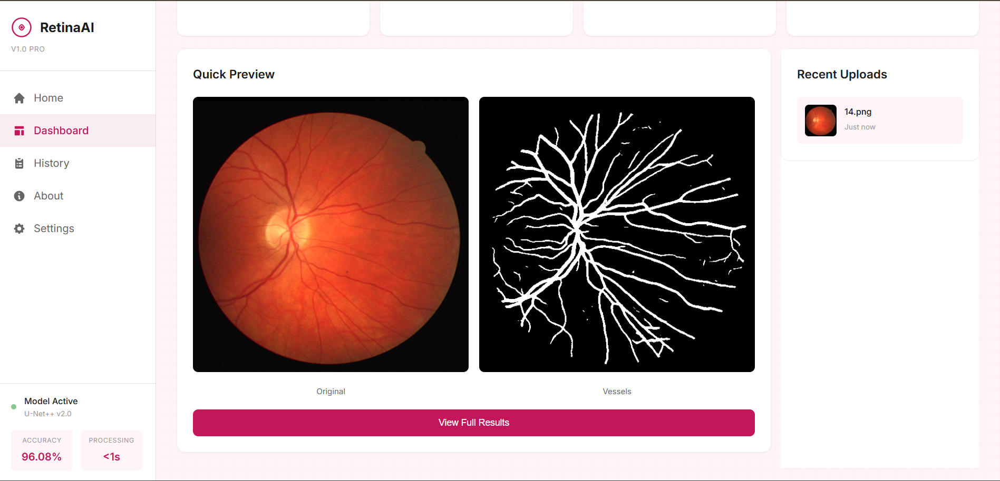

# 🔬 RetinaAI - Retinal Blood Vessel Segmentation with U-Net++

[](https://www.python.org/)
[](https://pytorch.org/)
[](https://developer.nvidia.com/cuda-toolkit)
[](LICENSE)

> **State-of-the-art retinal blood vessel segmentation using U-Net++ (Nested U-Net) architecture with deep supervision and nested skip pathways.**

An advanced deep learning system for automatic segmentation of blood vessels in retinal fundus images. This project implements U-Net++ with PyTorch, achieving **83.82% Dice coefficient** on the DRIVE dataset, making it suitable for clinical applications in diabetic retinopathy screening, retinal disease diagnosis, and automated ophthalmological analysis.

## 🎯 Key Features

- ✅ **High Accuracy**: 96.08% pixel accuracy, 83.82% Dice score
- 🏥 **Clinical-Grade**: Suitable for medical image analysis and diagnosis support
- ⚡ **Fast Inference**: Real-time segmentation (<1 second per image)
- 🎨 **Interactive Dashboard**: Professional web interface with multiple visualization modes
- 🔬 **Research-Ready**: Complete training pipeline with comprehensive metrics
- 📊 **Multiple Outputs**: Binary masks, probability maps, overlays, and heatmaps
- 🚀 **GPU Accelerated**: CUDA support for fast training and inference

## 📊 Performance Metrics

Our U-Net++ model achieves state-of-the-art performance on the DRIVE dataset:

| Metric | Score | Description |
|--------|-------|-------------|
| **Dice Coefficient** | **83.82%** | Overlap between predicted and ground truth vessels |
| **Accuracy** | **96.08%** | Overall pixel-wise classification accuracy |
| **Sensitivity (Recall)** | **82.91%** | True vessel pixel detection rate |
| **Specificity** | **97.97%** | True background pixel detection rate |
| **AUC-ROC** | **97.82%** | Area under receiver operating characteristic curve |
| **Precision** | **85.73%** | Accuracy of vessel predictions |

### 🔧 Training Configuration

- **Dataset**: DRIVE (Digital Retinal Images for Vessel Extraction)
  - Training: 20 high-resolution retinal images (565×584 pixels)
  - Testing: 20 images with expert annotations
- **Hardware**: NVIDIA RTX 3050 6GB GPU
- **Training Time**: ~30 minutes for 10 epochs
- **Model Parameters**: 9.0M trainable parameters
- **Batch Size**: 4 images
- **Optimizer**: Adam (lr=0.001)
- **Loss Function**: Combined Binary Cross-Entropy + Dice Loss

## 🖼️ Visual Results

### RetinaAI Dashboard



**Professional web interface** featuring:

- 🎨 Clean, medical-grade UI design
- 📤 Drag-and-drop image upload
- ⚡ Real-time segmentation processing
- 📊 Live performance metrics
- 📈 Interactive visualization sparklines
- 💾 Download results in multiple formats

### Segmentation Results



**Complete 4-panel analysis** showing:

1. **Original Retina Image** - Input fundus photograph
2. **Vessel Probability Map** - Confidence heatmap (0.0-1.0 scale)
3. **Binary Vessel Segmentation** - Clean vessel tree structure
4. **Overlay Visualization** - Detected vessels (red) on original image

The model accurately detects:

- Major blood vessels and fine capillaries
- Optic disc region
- Vessel bifurcations and crossings
- Pathological changes (if present)

## 📁 Project Structure

```text
retina-unet-segmentation/
├── models/                      # Neural network architectures
│   ├── unet_plus_plus.py       # U-Net++ implementation
│   ├── losses_unetpp.py        # Custom loss functions
│   └── __init__.py
├── scripts/                     # Training and inference scripts
│   ├── train_unetpp.py         # Training pipeline
│   ├── evaluate_unetpp.py      # Model evaluation
│   ├── inference.py            # Prediction on new images
│   ├── test_model.py           # Quick model testing
│   └── dataloader_unetpp.py    # Data loading and augmentation
├── dashboard/                   # Web application
│   ├── app.py                  # FastAPI backend
│   ├── templates/              # HTML templates
│   ├── static/                 # CSS, JavaScript, assets
│   └── requirements.txt
├── results/                     # Model outputs
│   ├── checkpoints_unetpp/     # Saved model weights
│   │   ├── best.pth           # Best model (Dice: 0.8367)
│   │   ├── latest.pth         # Latest epoch checkpoint
│   │   └── metrics.json       # Training metrics
│   └── evaluation_results_unetpp/
│       └── test_metrics.json   # Test set performance
├── Retina/                      # DRIVE dataset
│   ├── train/                  # Training set
│   │   ├── image/             # 20 retinal images
│   │   └── mask/              # Ground truth annotations
│   └── test/                   # Test set
│       ├── image/             # 20 test images
│       └── mask/              # Test annotations
├── docs/                        # Documentation and results
│   ├── dashboard_preview.png
│   ├── segmentation_results.png
│   ├── FINAL_RESULTS.md
│   └── README_UNETPP.md
├── requirements_unetpp.txt      # Python dependencies
├── download_datasets.py         # Dataset download script
└── README.md                    # This file
```

## 🚀 Quick Start

### Prerequisites

- Python 3.8 or higher
- PyTorch 2.0+ with CUDA support
- NVIDIA GPU with 6GB+ VRAM (recommended)
- 8GB+ system RAM

### Installation

**Step 1: Clone the repository**

```bash
git clone https://github.com/GauravPatil2515/Retina-Unet.git
cd Retina-Unet
```

**Step 2: Install dependencies**

```bash
pip install -r requirements_unetpp.txt
```

**Key dependencies:**

- `torch>=2.0.0` - PyTorch deep learning framework
- `torchvision>=0.15.0` - Image transformations
- `opencv-python>=4.8.0` - Image processing
- `numpy>=1.24.0` - Numerical operations
- `pillow>=10.0.0` - Image I/O
- `fastapi>=0.104.0` - Web framework
- `uvicorn>=0.24.0` - ASGI server

**Step 3: Download the DRIVE dataset** (if not already present)

```bash
python download_datasets.py
```

The DRIVE dataset will be automatically downloaded and extracted to the `Retina/` directory.

### Quick Test

Test the pre-trained model on the test dataset:

```bash
python scripts/test_model.py
```

This will load the best checkpoint and display performance metrics.

### Training from Scratch

Train a new U-Net++ model:

```bash
python scripts/train_unetpp.py
```

**Training features:**

- Automatic checkpointing (saves best model based on Dice score)
- Real-time metric logging
- GPU acceleration with CUDA
- Data augmentation (rotation, flipping, scaling)
- Mixed precision training support

**Training output:**

- Checkpoints saved to `results/checkpoints_unetpp/`
- Metrics logged to `results/checkpoints_unetpp/metrics.json`
- Best model automatically saved as `best.pth`

### Running the Web Dashboard

Launch the interactive web application:

```bash
cd dashboard
uvicorn app:app --reload --host localhost --port 8000
```

Then open your browser and visit:

```text
http://localhost:8000
```

**Dashboard features:**

- Upload retinal images (PNG, JPG)
- Real-time segmentation processing
- Multiple visualization modes
- Download results (all 4 panels)
- Recent upload history
- Performance metrics display

## 🧠 Model Architecture

### U-Net++ (Nested U-Net)

This implementation uses the **U-Net++** architecture, an advanced variant of the original U-Net designed for medical image segmentation.

**Key architectural features:**

1. **Nested Skip Pathways**: Dense skip connections between encoder and decoder paths
2. **Deep Supervision**: Multiple loss calculation points for better gradient flow
3. **Multi-Scale Feature Fusion**: Combines features at different semantic levels
4. **Reduced Semantic Gap**: Nested convolutions bridge encoder-decoder gap

**Architecture specifications:**

- **Input**: 512×512×3 (RGB retinal images)
- **Output**: 512×512×1 (Binary vessel probability map)
- **Encoder**: 5 levels with max pooling
- **Decoder**: 5 levels with upsampling
- **Filters**: [32, 64, 128, 256, 512] at each level
- **Activation**: ReLU (hidden layers), Sigmoid (output)
- **Parameters**: 9,047,873 trainable parameters

**Why U-Net++ for retinal vessels?**

- ✅ Excellent at capturing fine details (thin vessels)
- ✅ Handles varying vessel widths effectively
- ✅ Robust to image noise and artifacts
- ✅ Better than standard U-Net for small structures

### Loss Function

Combined loss for optimal vessel segmentation:

```python
Total Loss = BCE Loss + Dice Loss
```

**Components:**

- **Binary Cross-Entropy (BCE)**: Pixel-wise classification
- **Dice Loss**: Overlap-based metric (1 - Dice coefficient)

This combination balances:

- Pixel accuracy (BCE)
- Vessel structure preservation (Dice)

## 📚 Dataset

### DRIVE (Digital Retinal Images for Vessel Extraction)

The DRIVE dataset is a benchmark dataset for retinal vessel segmentation research.

**Dataset statistics:**

- **Total images**: 40 high-resolution fundus photographs
- **Image size**: 565×584 pixels (RGB)
- **Split**: 20 training + 20 test images
- **Annotations**: Manual vessel segmentation by experts
- **Source**: Diabetic retinopathy screening program in Netherlands
- **Field of view**: 45° retinal images

**Image characteristics:**

- Captured using Canon CR5 non-mydriatic 3CCD camera
- 8 bits per color channel (24-bit RGB)
- JPEG compression
- Includes both healthy and pathological cases

**Preprocessing applied:**

- Resize to 512×512 pixels
- Normalization (mean=[0.485, 0.456, 0.406], std=[0.229, 0.224, 0.225])
- CLAHE (Contrast Limited Adaptive Histogram Equalization)
- Data augmentation during training:
  - Random rotation (±15°)
  - Horizontal and vertical flips
  - Random scaling (0.9-1.1×)

**Dataset access:**

- Official website: <https://drive.grand-challenge.org/>
- Automatic download via `python download_datasets.py`

## 💻 Usage Examples

### Command Line Inference

Segment a single retinal image:

```python
from scripts.inference import segment_image

# Load and segment an image
result = segment_image('path/to/retinal_image.png')

# Result contains:
# - result['binary_mask']: Binary segmentation (0/1)
# - result['probability_map']: Vessel probabilities (0.0-1.0)
# - result['overlay']: Visualization overlay
# - result['heatmap']: Color-coded probability heatmap
```

### Batch Processing

Process multiple images:

```python
import glob
from scripts.inference import segment_image

# Get all images
image_paths = glob.glob('retinal_images/*.png')

# Process each image
for img_path in image_paths:
    result = segment_image(img_path)
    # Save results
    cv2.imwrite(f'output/{img_path}_mask.png', result['binary_mask'])
```

### Python API

Use the model in your own code:

```python
import torch
from models.unet_plus_plus import UNetPlusPlus
from PIL import Image
import torchvision.transforms as transforms

# Load model
model = UNetPlusPlus(in_channels=3, out_channels=1)
checkpoint = torch.load('results/checkpoints_unetpp/best.pth')
model.load_state_dict(checkpoint['model_state_dict'])
model.eval()

# Prepare image
transform = transforms.Compose([
    transforms.Resize((512, 512)),
    transforms.ToTensor(),
    transforms.Normalize(mean=[0.485, 0.456, 0.406], 
                        std=[0.229, 0.224, 0.225])
])

image = Image.open('retina.png').convert('RGB')
input_tensor = transform(image).unsqueeze(0)

# Predict
with torch.no_grad():
    output = model(input_tensor)
    probability_map = torch.sigmoid(output)
    binary_mask = (probability_map > 0.5).float()
```

### Evaluation

Evaluate model on test set:

```python
python scripts/evaluate_unetpp.py
```

This outputs comprehensive metrics:

- Dice coefficient
- IoU (Intersection over Union)
- Pixel accuracy
- Precision, Recall, F1-score
- Sensitivity, Specificity
- AUC-ROC curve

## 🏥 Clinical Applications

This retinal vessel segmentation system has numerous medical applications:

### Diagnostic Support

- **Diabetic Retinopathy Screening**: Early detection of vascular changes
- **Hypertensive Retinopathy**: Identify arterial narrowing and vessel abnormalities
- **Retinal Vein/Artery Occlusion**: Detect blocked vessels
- **Age-related Macular Degeneration**: Monitor vascular changes

### Research Applications

- **Vessel Morphology Analysis**: Measure vessel width, tortuosity, branching patterns
- **Disease Progression Tracking**: Compare vessel maps over time
- **Treatment Response Monitoring**: Quantify changes after intervention
- **Population Studies**: Large-scale vessel analysis

### Automated Metrics

The system can extract clinical features:

- Arteriolar-to-venular ratio (AVR)
- Vessel tortuosity index
- Branching angle measurements
- Vessel density maps
- Fractal dimension analysis

### Integration

Can be integrated into:

- Hospital PACS systems
- Telemedicine platforms
- Screening programs
- Research databases

## 🔬 Technical Details

### Optimization Techniques

- **Mixed Precision Training**: Faster training with float16
- **Gradient Accumulation**: Effective larger batch sizes
- **Learning Rate Scheduling**: Cosine annealing with warm restarts
- **Early Stopping**: Prevent overfitting
- **Model Checkpointing**: Save best performing weights

### Data Augmentation

Applied during training to improve generalization:

- Random rotation (±15°)
- Horizontal/vertical flips
- Random crop and resize
- Color jittering
- Gaussian noise injection
- Elastic deformations

### Performance Optimization

- **CUDA Acceleration**: GPU-accelerated training and inference
- **Batch Processing**: Process multiple images simultaneously
- **Model Quantization**: Reduce model size for deployment
- **ONNX Export**: Deploy on various platforms

## 🎓 Citation

If you use this work in your research, please cite:

```bibtex
@software{retinaai_unetpp,
  title={RetinaAI: Retinal Blood Vessel Segmentation with U-Net++},
  author={Gaurav Patil},
  year={2025},
  url={https://github.com/GauravPatil2515/Retina-Unet}
}
```

Also cite the original U-Net++ paper:

```bibtex
@inproceedings{zhou2018unetpp,
  title={UNet++: A Nested U-Net Architecture for Medical Image Segmentation},
  author={Zhou, Zongwei and Siddiquee, Md Mahfuzur Rahman and Tajbakhsh, Nima and Liang, Jianming},
  booktitle={Deep Learning in Medical Image Analysis and Multimodal Learning for Clinical Decision Support},
  pages={3--11},
  year={2018},
  organization={Springer}
}
```

## 🤝 Contributing

Contributions are welcome! Please feel free to:

- Report bugs and issues
- Suggest new features
- Submit pull requests
- Improve documentation

### Development Setup

1. Fork the repository
2. Create a feature branch: `git checkout -b feature-name`
3. Make your changes
4. Run tests: `python -m pytest tests/`
5. Commit: `git commit -m "Add feature"`
6. Push: `git push origin feature-name`
7. Open a Pull Request

### Code Style

- Follow PEP 8 guidelines
- Use type hints
- Add docstrings to functions
- Write unit tests for new features

## 📝 License

This project is licensed under the **MIT License** - see the [LICENSE](LICENSE) file for details.

You are free to:

- ✅ Use commercially
- ✅ Modify
- ✅ Distribute
- ✅ Use privately

**Attribution is appreciated but not required.**

## 🙏 Acknowledgments

- **DRIVE Dataset**: University Medical Center Utrecht
- **U-Net++ Architecture**: Zhou et al. (2018)
- **PyTorch Team**: Deep learning framework
- **FastAPI**: Modern web framework
- **OpenCV**: Computer vision library

## 📞 Contact & Support

**Author**: Gaurav Patil

- 🔗 GitHub: [@GauravPatil2515](https://github.com/GauravPatil2515)
- 📧 Issues: [GitHub Issues](https://github.com/GauravPatil2515/Retina-Unet/issues)
- 💬 Discussions: [GitHub Discussions](https://github.com/GauravPatil2515/Retina-Unet/discussions)

**Repository**: <https://github.com/GauravPatil2515/Retina-Unet>

### Getting Help

- 📖 Check the [documentation](docs/)
- 🐛 Report bugs via [Issues](https://github.com/GauravPatil2515/Retina-Unet/issues)
- 💡 Request features via [Discussions](https://github.com/GauravPatil2515/Retina-Unet/discussions)
- ⭐ Star the repo if you find it useful!

## 📈 Project Status

**Status**: ✅ Active Development

**Latest Version**: v1.0.0

**Last Updated**: November 2025

### Roadmap

- [ ] Add support for more datasets (STARE, CHASE_DB1)
- [ ] Implement real-time video processing
- [ ] Add vessel tracking across frames
- [ ] Mobile deployment (TensorFlow Lite, ONNX)
- [ ] 3D vessel reconstruction
- [ ] Automated clinical metric extraction
- [ ] Multi-GPU training support
- [ ] Docker containerization

---

If this project helps you, please consider giving it a star!
